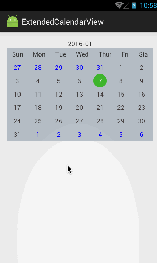

# CalendarView

## Introdce

这是一个CalendarView的demo，实现最基本的Calendar功能，本想做到更抽象的，考虑到定制化程度都教大，简单的demo更易于理解。

## Tips

* CalendarView是基于GridView实现的
* CalendarViewPager是ViewPager+CalendarView
* ViewPager+GridView会导致ViewPager高度最大，只使用WrapContentHeightViewPager导致GridView只显示一行，故使用WrapContentHeightViewPager+MatchParentGridView组合实现ViewPager高度自适应内容
* CalenderAdapter.setIsOutMonthHide用于显示超出本月范围日期是否显示

